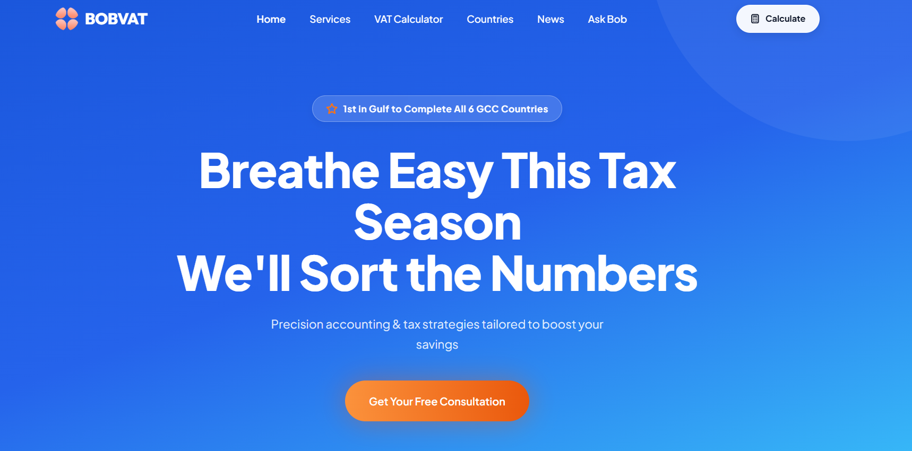

# Bob VAT - GCC Compliance App

This project is a comprehensive solution for GCC VAT compliance, featuring a Next.js frontend and a Python-powered backend.

## 🚀 Built with IBM Bob Agent
This entire project has been meticulously generated and optimized using the **IBM Bob Agent**. The agent played a critical role in:
- Architecting the frontend with Next.js and Tailwind CSS.
- Implementing the backend logic for VAT calculations and GCC compliance rules.
- Integrating AI-driven document analysis and reporting features.
- Ensuring seamless communication between the frontend and backend services.

## Project Structure
- **/frontend**: Next.js web application.
- **/backend**: Python FastAPI/Flask backend with AI integrations.

## Environment Setup
Both frontend and backend require `.env` files for configuration. Refer to the respective directories for setup instructions.



---

## 🌟 Key Features

### 🌍 Complete GCC Coverage


- **UAE** (5% VAT) - Active
- **Saudi Arabia** (15% VAT) - Active
- **Bahrain** (10% VAT) - Active
- **Oman** (5% VAT) - Active
- **Qatar** (Pending) - Advisory mode
- **Kuwait** (Pending) - Advisory mode

### 🛠️ 10+ Professional Tools

1. **VAT Calculator** - Instant calculations with live rate lookups and legal citations
2. **Registration Checker** - Verify mandatory threshold status with revenue comparisons
3. **Invoice Validator** - Smart analytics to check VAT compliance on invoices
4. **Cross-Border Advisor** - B2B/B2C international transaction rules
5. **Penalty Calculator** - Estimate late filing/payment fines (includes UAE 2026 rules)
6. **Tax Consultant Chat** - Bilingual AI assistant with live web search
7. **Exempt/Zero-Rate Checker** - Verify tax-free product categories
8. **Kuwait/Qatar Readiness** - Prepare for upcoming VAT implementations
9. **Deadline Tracker** - Never miss monthly/quarterly filing dates
10. **Live News Feed** - Real-time regulatory updates and rate changes

### 🎯 Core Capabilities

- ✅ **Bilingual Support** - Full Arabic and English interface
- ✅ **Live Data Search** - Real-time database monitoring for latest regulations
- ✅ **Legal Citations** - Every calculation includes source references
- ✅ **Bank-Grade Accuracy** - Precision calculations for financial compliance
- ✅ **Smart Analytics** - Context-aware insights and recommendations
- ✅ **API Integration** - REST API for ERP/POS system integration

---

## 🚀 Quick Start

### Prerequisites

- **Node.js** 20.x or higher
- **npm** or **yarn** or **pnpm**
- **Backend API** running on `http://localhost:8000` (required for full functionality)

### Installation (Frontend)

```bash
cd frontend
# Install dependencies
npm install
# Run development server
npm run dev
```

Open [http://localhost:3000](http://localhost:3000) in your browser.

### Installation (Backend)

```bash
cd backend
# Install dependencies
pip install -r requirements.txt
# Run server
python main.py
```

---

## 📁 Detailed Project Structure

```
Bob_Vat-GCC-Compliance-App/
├── frontend/                 # Next.js App Router pages
│   ├── app/                 # Pages and routes
│   ├── components/          # Reusable React components
│   ├── public/              # Static assets
│   └── package.json         # Dependencies & scripts
├── backend/                  # Python FastAPI application
│   ├── models/              # Pydantic schemas
│   ├── services/            # Business logic & AI integration
│   ├── prompts/             # LLM templates
│   └── main.py              # API endpoints
├── README.md                 # This file
└── ibm_bob_build_log.txt     # Build history
```

---

## 🎨 Tech Stack

### Frontend
- **Framework**: Next.js 16.2.6 (App Router)
- **UI Library**: React 19.2.4
- **Language**: TypeScript 5.x
- **Styling**: Custom CSS with CSS Variables

### Backend
- **Framework**: FastAPI
- **Language**: Python 3.11+
- **AI**: Qwen LLM, Tavily Search

---

*Generated with ❤️ by IBM Bob Agent*
